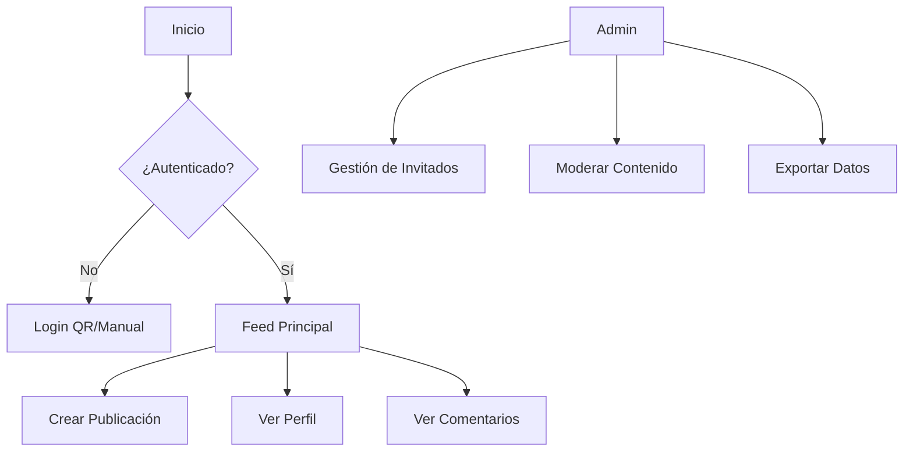

# Documentación Completa de QR Social
Estoy trabajando en mi pagina llamada qr social. es una pagina que permite a los invitados de un evento (en este caso una boda) tener una red social privada para documentar todo el evento. la idea es que la gente suba sus imagenes y videos y posteos y lo que quieran compartir y todo se aloje en una base de datos y luego los organizadores del evento (en este caso de la boda, serian los novios) podran bajar todo el archivo de las imagenes del dia de su casamiento. Debe tener una interfaz amigable y muy similar a instagram para que los usuario ya lo tengan conocido y no sea algo complicado de aprender, sino que sea algo que ya conocen y simplemente pueden usar para ese dia pero de manera "privada" ya que es una red social cerrada y privada para la lista de invitados. la idea es que cada invitado tenga un qr en la boda impreso y de esa manera pueden ingresar a la red social y libremente compartir lo que quieran ya logueados. 
# Documentación Completa de QR Social - README

## Tabla de Contenidos
1. [Introducción](#1-introducción)
2. [Características Principales](#2-características-principales)
3. [Guía de Usuario](#3-guía-de-usuario)
4. [Estructura del Proyecto](#4-estructura-del-proyecto)
5. [Componentes Clave](#5-componentes-clave)
6. [Estilos y Diseño](#6-estilos-y-diseño)
7. [Configuración Técnica](#7-configuración-técnica)
8. [Seguridad](#8-seguridad)
9. [Roadmap](#9-roadmap)

## 1. Introducción
QR Social es una red social privada para eventos, diseñada específicamente para bodas. Permite a los invitados compartir fotos, videos y mensajes en un entorno cerrado, similar a Instagram pero exclusivo para los asistentes al evento.

**Propósito Principal**: Crear un archivo digital colaborativo del evento que los organizadores (novios) puedan descargar posteriormente.

## 2. Características Principales
- **Acceso mediante QR**: Cada invitado recibe un código QR único
- **Interfaz familiar**: Diseño inspirado en Instagram para fácil adopción
- **Contenido privado**: Solo visible para los invitados confirmados
- **Panel de administración**: Para gestión de invitados y contenido
- **Exportación de datos**: Descarga completa de todas las publicaciones

## 3. Guía de Usuario

### 3.1 Para Invitados
1. **Acceso al sistema**:
   - Escanear QR en la mesa de recepción
   - Opción manual ingresando nombre completo

2. **Interfaz principal**:
   - Feed de publicaciones similar a Instagram
   - Botón "+" para crear nuevas publicaciones
   - Historias temporales (24 horas)

3. **Perfil personal**:
   - Ver todas tus publicaciones
   - Editar biografía breve
   - Ver relación con los novios

### 3.2 Para Organizadores (Admin)
1. **Panel de control**:
   - Ver estadísticas de participación
   - Gestionar lista de invitados
   - Moderar contenido

2. **Exportación de datos**:
   - Descargar todas las fotos/videos
   - Opción de crear álbum digital

## 4. Estructura del Proyecto

### 4.1 Arquitectura de Componentes
```
src/
├── componentes/
│   ├── auth/            # Componentes de autenticación
│   ├── user/            # Vistas de usuario regular
│   ├── admin/           # Panel de administración
│   └── shared/          # Componentes reutilizables
├── context/             # Gestión de estado global
├── assets/
│   ├── scss/            # Estilos organizados por componentes
│   └── img/             # Recursos visuales
└── utils/               # Funciones auxiliares
```

### 4.2 Flujo de la Aplicación


## 5. Componentes Clave

### 5.1 App.jsx
**Propósito**: Componente raíz que configura:
- Enrutamiento principal
- Provee contexto de autenticación
- Define estructura base del layout

**Estructura**:
```javascript
<Router>
  <AuthProvider>
    <MainLayout>
      <Routes>
        {/* Rutas públicas */}
        <Route path="/login" element={<LoginPage />} />
        
        {/* Rutas protegidas */}
        <Route path="/feed" element={<FeedPage />} />
        
        {/* Rutas de admin */}
        <Route path="/admin" element={<AdminLayout />}>
          <Route path="guests" element={<GuestManager />} />
        </Route>
      </Routes>
    </MainLayout>
  </AuthProvider>
</Router>
```

### 5.2 AuthContext.jsx
**Funcionalidades**:
- `loginWithQR`: Autenticación mediante código QR
- `loginAsGuest`: Acceso manual para invitados
- `logout`: Cierra sesión
- `currentUser`: Datos del usuario actual

### 5.3 LoginPage.jsx
**Flujo de acceso**:
1. Pantalla de bienvenida con dos opciones:
   - Escanear QR (componente QrLogin)
   - Acceso manual (formulario simple)

2. En desarrollo: Acceso rápido con usuario demo

### 5.4 FeedPage.jsx
**Características**:
- Muestra timeline de publicaciones
- Integra componente Stories
- Formulario para nuevos posts
- Diseño responsive mobile-first

## 6. Estilos y Diseño

### 6.1 Principios de Diseño
- **Mobile-first**: Todos los estilos comienzan por móvil
- **Breakpoints**:
  - Tablet: `@media (min-width: 768px)`
  - Desktop: `@media (min-width: 1024px)`
- **Consistencia visual**: Mantener patrón similar a Instagram

### 6.2 Estructura SCSS
```scss
// Ejemplo de estructura modular
.instagram-header {
  // Estilos base para móvil
  @media (min-width: 768px) {
    // Ajustes tablet
  }
  @media (min-width: 1024px) {
    // Ajustes desktop
  }
}
```

## 7. Configuración Técnica

### 7.1 Dependencias Clave
```json
"dependencies": {
  "react": "^18.2.0",
  "react-router-dom": "^6.14.2",
  "firebase": "^9.22.0",
  "react-icons": "^4.8.0",
  "jsqr": "^1.4.0"
}
```

### 7.2 Estructura de Datos en Firebase
```javascript
{
  "events": {
    "eventId": {
      "name": "Nombre del Evento",
      "date": "2023-12-15"
    }
  },
  "guests": {
    "guestId": {
      "name": "Nombre Invitado",
      "qrCode": "hash-unico",
      "confirmed": true
    }
  },
  "posts": {
    "postId": {
      "userId": "guestId",
      "imageUrl": "url/imagen.jpg",
      "likes": ["userId1", "userId2"]
    }
  }
}
```

## 8. Seguridad
- **Autenticación**: 
  - Códigos QR con hash único
  - Validación manual contra lista de invitados
- **Permisos**:
  - Usuarios solo pueden editar su propio contenido
  - Panel admin protegido por rol
- **Firebase Rules**:
  - Lectura limitada a invitados confirmados
  - Escritura validada por UID

## 9. Roadmap
- [ ] Notificaciones en tiempo real
- [ ] Filtros para fotos/videos
- [ ] Integración con servicios de álbumes fotográficos
- [ ] Mejoras en accesibilidad
- [ ] Analytics para organizadores

## Guía de Contribución
1. Clonar repositorio
2. Instalar dependencias: `npm install`
3. Configurar variables de entorno Firebase
4. Ejecutar en desarrollo: `npm start`
5. Seguir convenciones de código existentes

## Licencia
MIT License - Uso libre para fines no comerciales