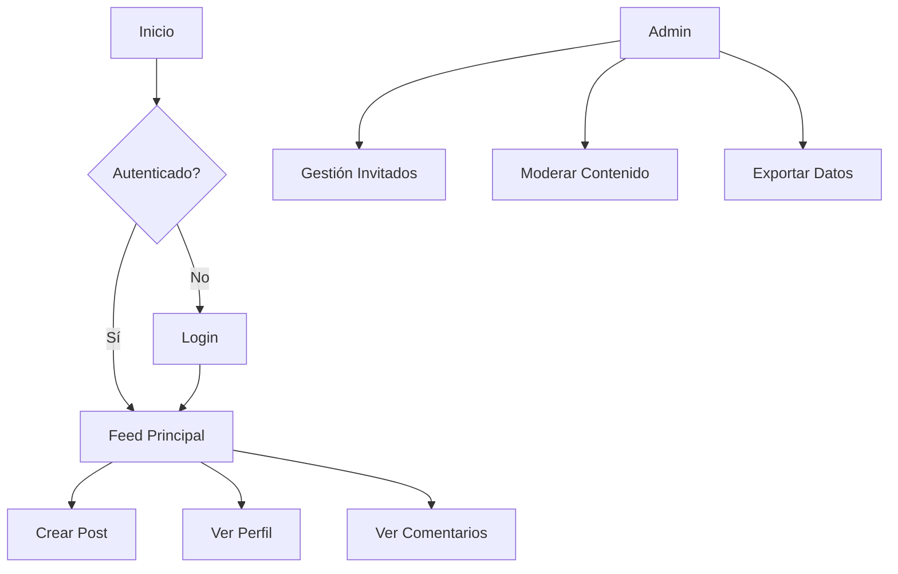

# Documentación Completa de QR Social

## 1. Introducción

**QR Social** es una red social privada para eventos, donde los invitados pueden:
- Acceder mediante QR o credenciales simples
- Compartir fotos, videos y mensajes
- Interactuar con otros asistentes
- Los organizadores tienen un panel de administración completo

## 2. Flujo de Usuario

### 2.1. Acceso al Sistema
1. **Pantalla de Login**: `/login`
   - Opción de escanear QR
   - Opción de ingresar como invitado
2. **Feed Principal**: `/feed`
   - Vista de todas las publicaciones
   - Formulario para crear nuevos posts
3. **Perfil**: `/profile/:id`
   - Publicaciones del usuario
   - Información básica

### 2.2. Panel de Administración
1. **Dashboard**: `/admin`
   - Estadísticas del evento
2. **Gestión de Invitados**: `/admin/guests`
   - Listado y confirmación
3. **Gestión de Contenido**: `/admin/content`
   - Moderación de publicaciones
4. **Exportación de Datos**: `/admin/export`
   - Descarga de toda la información

## 3. Documentación de Componentes

### 3.1. Componentes Principales

#### App.jsx
```markdown
**Propósito**: Componente raíz que configura el enrutamiento principal  
**Rutas**:
- Públicas: `/login`, `/feed`, `/profile/:id`
- Administración: `/admin/*` (protegidas)
**Dependencias**:
- AuthProvider: Contexto de autenticación
- React Router: Manejo de rutas
```

#### AuthContext.jsx
```markdown
**Propósito**: Gestiona el estado global de autenticación  
**Funcionalidades**:
- `loginWithQR`: Autentica con código QR
- `loginAsGuest`: Autentica como invitado
- `logout`: Cierra sesión
- `currentUser`: Datos del usuario actual
**Almacenamiento**: Guarda estado en localStorage
```

#### MainLayout.jsx
```markdown
**Propósito**: Layout principal de la aplicación  
**Estructura**:
- Header
- Contenido principal
- Footer
**Responsive**: Adapta disposición en móvil/desktop
```

### 3.2. Componentes de Autenticación

#### LoginPage.jsx
```markdown
**Propósito**: Pantalla de acceso al sistema  
**Componentes incluidos**:
- QrLogin.jsx: Lector de códigos QR
- GuestLogin.jsx: Formulario para invitados
**Flujo**:
- Redirige a /feed al autenticar correctamente
```

#### QrLogin.jsx
```markdown
**Propósito**: Componente de escaneo QR  
**Tecnología**: Usa react-qr-reader
**Eventos**:
- Escaneo exitoso: llama a loginWithQR
- Error: muestra mensaje al usuario
```

### 3.3. Componentes del Feed

#### FeedPage.jsx
```markdown
**Propósito**: Muestra el timeline de publicaciones  
**Funcionalidades**:
- Carga posts desde Firebase
- Filtrado por tipo (todos/mis posts)
- Integra PostForm para nuevas publicaciones
**Optimización**: Virtualización con react-window
```

#### Post.jsx
```markdown
**Propósito**: Muestra una publicación individual  
**Interacciones**:
- Like/Reacciones
- Comentarios
- Compartir
**Accesibilidad**: Roles ARIA y etiquetas semánticas
```

#### PostForm.jsx
```markdown
**Propósito**: Formulario para crear publicaciones  
**Capacidades**:
- Texto
- Subida de imágenes
- Preview de contenido
**Validaciones**: Campos requeridos
```

### 3.4. Componentes de Administración

#### AdminLayout.jsx
```markdown
**Propósito**: Layout del panel de administración  
**Protección**: Solo accesible para rol 'admin'
**Estructura**:
- Sidebar de navegación
- Área de contenido principal
```

#### GuestManager.jsx
```markdown
**Propósito**: Gestión de lista de invitados  
**Funcionalidades**:
- Búsqueda/filtrado
- Confirmación de asistencia
- Paginación
**Conexiones**: Firebase Realtime Database
```

#### DataExporter.jsx
```markdown
**Propósito**: Exportación de datos del evento  
**Formatos soportados**:
- JSON (completo o por secciones)
**Tecnología**: Usa file-saver para descargas
```

### 3.5. Componentes Auxiliares

#### Header.jsx
```markdown
**Propósito**: Barra de navegación superior  
**Contenido dinámico**:
- Muestra opciones según rol (invitado/admin)
- Iconos de navegación principal
**Responsive**: Colapsa en móvil
```

#### Stories.jsx
```markdown
**Propósito**: Muestra historias temporales (24h)  
**Características**:
- Reproductor con progreso
- Navegación entre historias
- Marca como vistas al visualizar
```

## 4. Estructura de Estilos

### 4.1. Arquitectura SCSS
```
src/assets/scss/
├── _01-General/        # Estilos globales
│   └── _App.scss       # Estructura base
└── _03-Componentes/    # Estilos por componente
    ├── _Header.scss
    ├── _FeedPage.scss
    └── _Post.scss      # etc...
```

### 4.2. Convenciones
- **Mobile-first**: Todos los estilos comienzan por móvil
- **Breakpoints**:
  - Tablet: `@media (min-width: 768px)`
  - Desktop: `@media (min-width: 1024px)`
- **Clases**: Nombres descriptivos y consistentes

## 5. Diagrama de Flujo



## 6. Guía de Estilos Visuales

### 6.1. Paleta de Colores
- **Primario**: `#3498db` (Azul)
- **Secundario**: `#2ecc71` (Verde)
- **Acento**: `#e74c3c` (Rojo)
- **Fondos**: `#f8f9fa` (Gris claro)

### 6.2. Tipografía
- **Principal**: 'Poppins', sans-serif
- **Secundaria**: 'Montserrat', sans-serif
- **Tamaños**:
  - Móvil: 14px base
  - Desktop: 16px base

## 7. Configuración Técnica

### 7.1. Dependencias Clave
```markdown
- React 18
- React Router 6
- Firebase (Firestore, Storage)
- react-icons
- moment.js (manejo de fechas)
- file-saver (exportación)
```

### 7.2. Estructura de Firebase
```javascript
{
  "events": {
    "eventId": {
      "name": "Boda de Ale y Fabi",
      "date": "2023-12-15"
    }
  },
  "guests": {
    "guestId": {
      "name": "Invitado Ejemplo",
      "eventId": "eventId",
      "confirmed": true
    }
  },
  "posts": {
    "postId": {
      "userId": "guestId",
      "text": "Contenido del post",
      "image": "url/imagen.jpg",
      "likes": ["userId1", "userId2"],
      "comments": {
        "commentId": {
          "userId": "userId",
          "text": "Texto del comentario"
        }
      }
    }
  }
}
```

## 8. Manual de Uso

### 8.1. Para Invitados
1. Escanear QR o ingresar nombre
2. Navegar por el feed de publicaciones
3. Crear nuevos posts con fotos/texto
4. Interactuar con otros contenidos

### 8.2. Para Administradores
1. Acceder a `/admin` con credenciales
2. Gestionar lista de invitados
3. Moderar contenido inapropiado
4. Exportar datos post-evento

## 9. Consideraciones de Seguridad

```markdown
1. Autenticación:
   - QR con hash único
   - Credenciales básicas para invitados
   
2. Permisos:
   - Usuarios regulares solo pueden editar su contenido
   - Panel admin protegido por rol

3. Firebase Rules:
   - Lectura abierta para contenido público
   - Escritura validada por UID
```

## 10. Roadmap y Mejoras Futuras

```markdown
- [ ] Notificaciones en tiempo real
- [ ] Búsqueda avanzada de contenido
- [ ] Filtros para fotos/videos
- [ ] Integración con redes sociales
- [ ] Analytics avanzado para organizadores
```

# qrsocial
